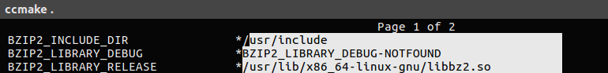
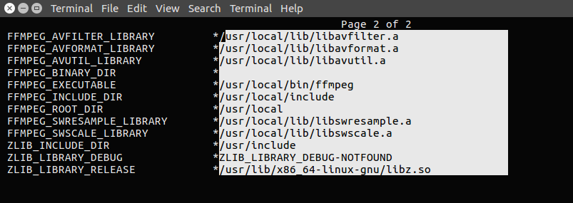

# Usando libs externas

O CMake utiliza modulos para encontrar libs de maneira pratica e inclui-las no projeto, quando o Cmake é instalado ele já vem com milhares desses módulos já instalados, utilizando o comando
`cmake --help-module-list` é possível ver todos os modulos que o cmake possui. Todos os files desses modulos ficam localizado na pasta de instalação do cmake *cmake/module*  no caso do Ubuntu
*/usr/share/cmake/Modules/* .

No exemplo a seguir eu vou adicionar algumas bibliotecas que já vem com os módulos por padrão no CMake *zlib BZip2 pthread*

```
#include BZip2
find_package(BZip2 REQUIRED)
include_directories(${BZIP2_INCLUDE_DIRS})
set(LIBS ${LIBS} ${BZIP2_LIBRARIES})

#include Zlib
find_package(ZLIB REQUIRED)
include_directories(${ZLIB_INCLUDE_DIRS})
set(LIBS ${LIBS} ${ZLIB_LIBRARIES})

#include pThreads
find_package(Threads REQUIRED)
set(LIBS ${LIBS} ${CMAKE_THREAD_LIBS_INIT})

target_link_libraries(projeto ${LIBS})
```
Para adicionar as libs usamos o comando [find_package](https://cmake.org/cmake/help/v3.0/command/find_package.html)  onde o único argumento obrigatório é o nome do pacote. Assim que o módulo é encontrado
é possível utilizar as variáveis disponibilizadas pelo modulo para adicionar a lib e a header, é possível verificar o nome das variáveis usando o comando `cmake --help-module nome_do_package` .

Todas as libs encontradas eu adicionei na variavel `${LIB}` para ficar mais prático de fazer o link no final do Projeto.

## Adicionando libs que não vem no pacote do CMake

Primeiro na raiz do projeto adicione o seguinte diretório *cmake/Module* em seguida no CMakeLists.txt adicione as seguintes linhas :

```
set(CMAKE_MODULE_PATH ${CMAKE_MODULE_PATH} "${CMAKE_SOURCE_DIR}/cmake/Module/")

```
Agora o nosso diretório será reconhecido para a busca dos packages, em seguida adicione todos os packages que não estão presentes por padrão na pasta module e pronto.

Se você usar o cmake-gui ou o ccmakke as variáveis irão aparecer no cache!




## Referências

[CMake Wiki](https://cmake.org/Wiki/CMake:How_To_Find_Libraries)

