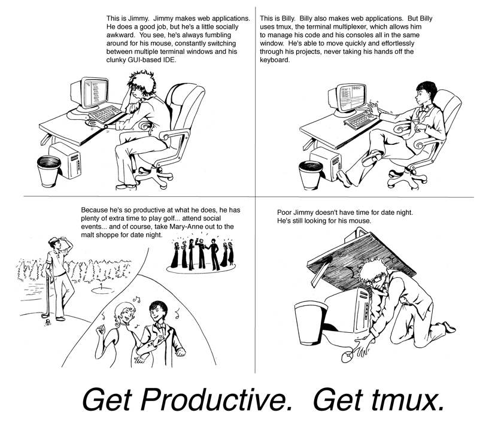
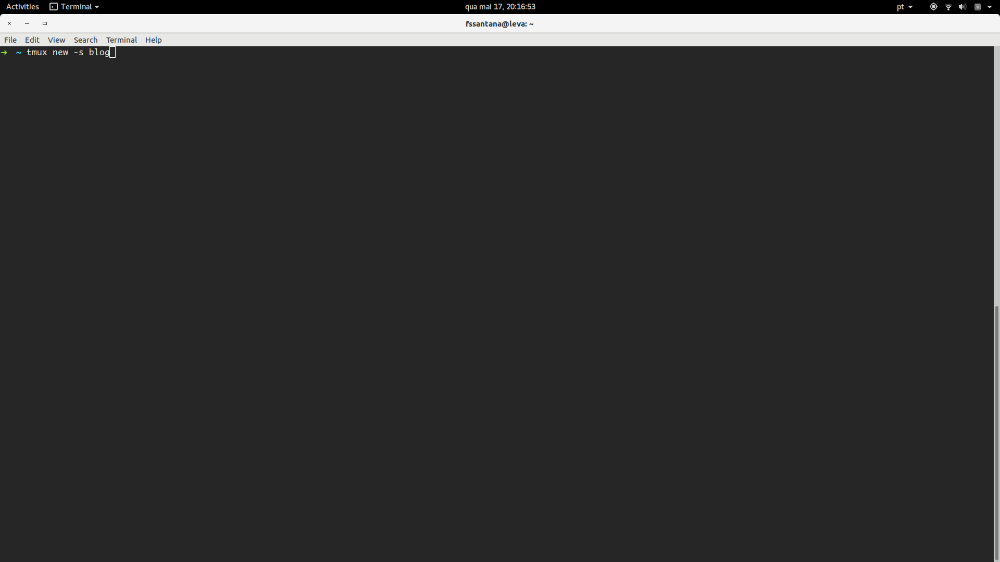
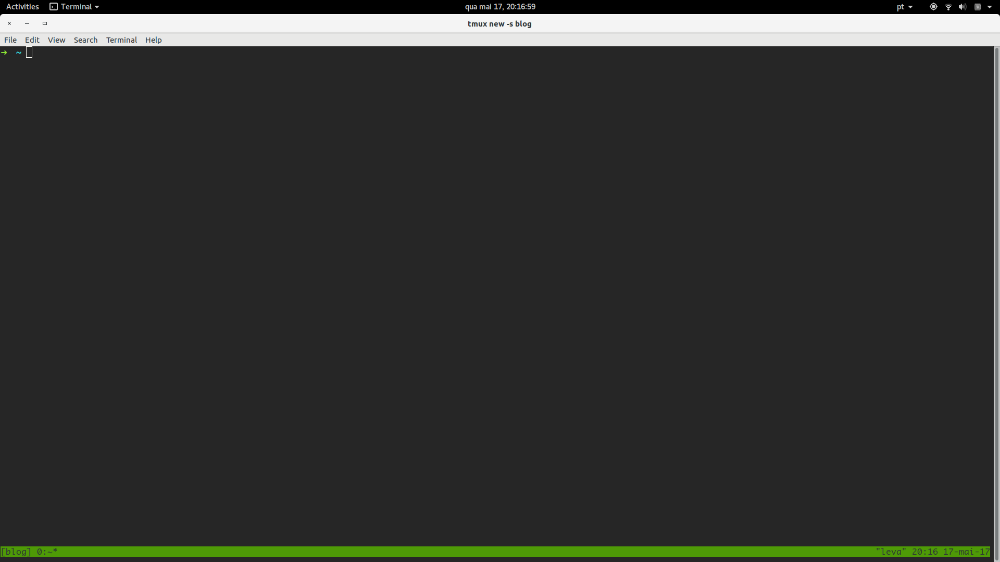
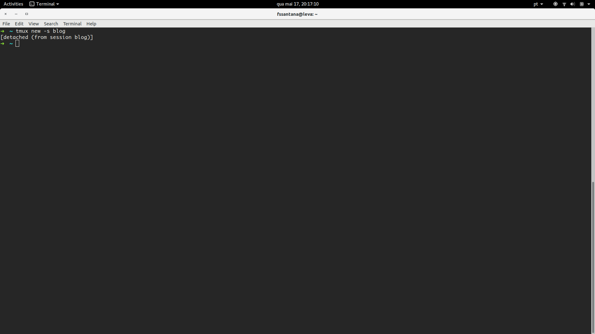
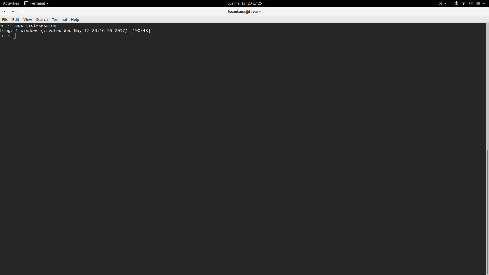
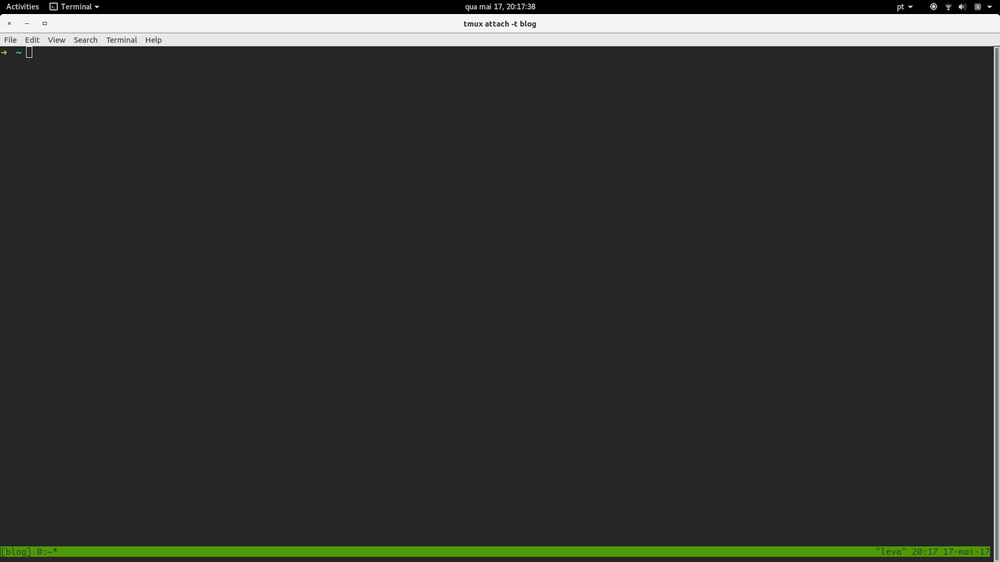
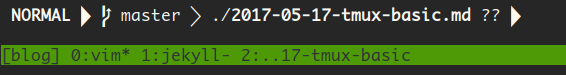
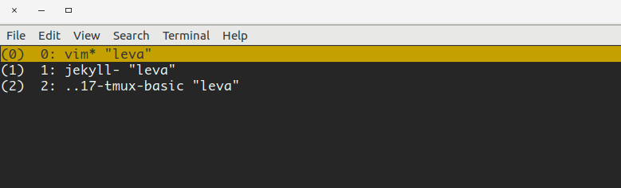
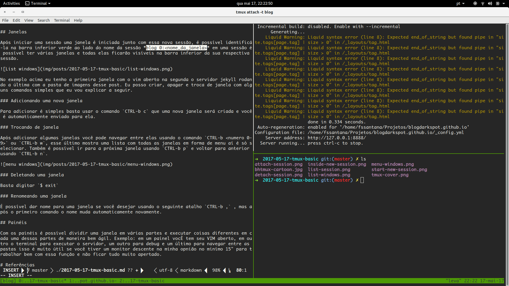

# Deixando o mouse de lado

Aqui começa uma jornada para deixar aquele "facilitador" na vida de quem usa um computador, o tal do mouse. Depois de alguns anos usando o Linux eu notei que eu conseguia me localizar melhor dentro do sistema através do terminal, após isso comecei a usar um pouco do vim para desenvolver já que alguns amigos diziam ser uma ótima ferramenta para desenvolvimento. Até aí beleza eu tenho o terminal para trabalhar com os arquivos e tenho o vim para editar arquivos, agora só falta algo para gerenciar os terminais, afinal eu faço várias coisas ao mesmo tempo, o que acaba gerando um monte de telas de terminais e eu acabo usando mouse já que o alt+tab não é tão eficiente assim. O tmux veio para solucionar esse problema.

# O que é o Tmux?

Tmux é um *Terminal multiplexer*. Com ele é possível em um único ambiente criar vários terminais ou janelas e cada um rodar o seus próprios processos, beleza é possível fazer isso com outros terminais abrindo abas, mas o tmux tem muito mais poder, por exemplo, é possível em uma sessão do tmux rodar um processo e depois deixá-lo em background sem precisar ficar com um monte de telas abertas e depois disso reabrir a janela como se ela nunca tivesse sido fechada antes é possível fazer várias outras coisas também, só que nesse post vamos tratar do básico que é justamente o essa função de manipular sessões, janelas e painéis.

# Sessões, Janelas e Painéis

A hierarquia do tmux funciona da seguinte forma: Ao iniciar o tmux a partir de um terminal é criada uma sessão, essa sessão tem uma janela e a janela tem um painel. Nessa hierarquia do tmux ele pode ter n sessões, cada sessão pode ter n janelas e cada janela n painéis.

## Sessões

### Criando sessões

Para criar uma sessão no tmux é bem simples, basta digitar `$ tmux` e uma sessão anônima começa.
Também é possível iniciar sessões e nomeá-las  com o seguinte comando `$ tmux new -s <nome_da_sessão>`. Assim na barra inferior verde no canto inferior esquerdo irá aparecer o nome da sessão que está atualmente em execução.

### Saíndo das sessões

Sair de uma sessão é simples basta usar o comando `$ exit` e você voltará a antiga tela do terminal. Porem é possível sair de uma sessão e não finalizar ela, isso que dizer que ela ficará viva em background, basta usar o comando `$ tmux detach` ou o atalho *CTRL-b d*.

### Vendo lista de sessões

Quando saímos de uma sessão e voltamos para o terminal normal novamente é possível fazer o link com a sessão que está executando o background. Para verificar os nomes de todas as sessõesuse `tmux list-session`.

### Voltando para sessão

Após verificar o nome de todas as sessões ativas para voltar a utilizar alguma delas basta usar `tmux attach -t <nome_da_sessao>`.

## Deletando Sessões

Para deletar as sessões que estão rodando em background use o comando `$ tmux kill-session -t <nome_da_sessão>`

## Janelas

Após iniciar uma sessão uma janela é iniciada junto com essa nova sessão, é possível identificá-la na barra inferior verde ao lado do nome da sessão *blog 0:<nome_da_janela>* em uma sessão é possível ter várias janelas e todas elas ficarão visíveis na barra inferior da sua respectiva sessão.

No exemplo acima eu tenho a primeira janela com o vim aberto na segunda o servidor jekyll rodando a última com a pasta de imagens desse post. Eu posso criar, apagar e troca de janela com alguns comandos simples que eu vou explicar a seguir.

### Adicionando uma nova janela

Para adicionar é simples basta usar o comando `CTRL-b c` que uma nova janela será criada e você é automaticamente enviado para ela.

### Trocando de janela

Após adicionar algumas janelas você pode navegar entre elas usando o comando `CTRL-b <numero 0-9>` ou `CTRL-b w`, esse último mostra uma lista com todas as janelas em forma de menu aí é só selecionar. Também é possível ir para a próxima janela usando `CTRL-b p` e voltar para anterior usando `CTRL-b n`.

### Deletando uma janela

Basta digitar `$ exit`

### Renomeando uma janela

É possível dar nome para uma janela se você desejar usando o seguinte atalho `CTRL-b ,` , mas após o primeiro comando o nome muda automaticamente novamente.

## Painéis

Com os painéis é possível dividir uma janela em várias partes e executar coisas diferentes em cada uma dessas partes de maneira bem ágil. Exemplo: em um painel vocÊ tem seu VIM aberto, em outro o terminal para executar o servidor, um outro para debug e um último para navegar entre as pastas isso é muito útil se você tiver um monitor descente na minha opnião no minímo 15" para trabalhar bem com essa função e não ficar tudo muito apertado.

No exemplo acima eu estou escrevendo esse artigo, enquanto testo o servido e vejo o nome correto das imagens e coloco na pasta correta, tudo isso somente em uma Janela, bem prático, não?

### Criando Painéis

Para dividir uma janela na horizontal pressione `CTRL-b %` para dividir o painel atual na vertical use `CTRL-b "`.

### Navegando pelos painéis

Para sair de um painel para outro use `CTRL-b <setas_direcionais>` qualquer seta que você usar será o sentido do próximo painel.

### Deletando painéis

Para deletar um painel basta pressionar `CTRL-b x` uma pergunta de confirmação na parte inferiror irá aparecer perguntando se você deseja realmente excluir esse painel.

# Conclusão

O Tmux é uma ferramenta eficiente que ajuda a agilizar o trabalho do dia-a-dia sem a necessidade de ter que ficar trocando de janela toda hora, tirar a mão do teclado e usar o mouse, com os poucos segundos que você vai acumulando em cada vez que você deixa de tocar o mouse ou janela, no final do dia pode ser um grande tempo economizado.

# Referências
[Tmux 2 Productive Mouse-free Development](https://pragprog.com/book/bhtmux2/tmux-2)
