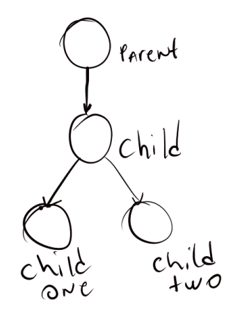

QObject é a classe base que deve ser herdada para poder usar meta-object system e seus recursos. 
Um desses recursos é poder organizar objetos em uma árvore.

### Criando nossa árvore hierarquica de QObjects

Desenho da nossa estrutura de estudos

Implementação da estrutura

~~~c++
#include <QObject>
#include <QDebug>
#include <QString>

void print_children(QObject *root, int lvl = 0)
{
    auto children = root->children();
    lvl++;
    QString qprint = QString("level %1 %2").arg(lvl).arg(root->objectName());
    for(auto child : children)
    {
        print_children(child, lvl);
    }
    qDebug() << qprint ;
}

void object_names_and_tree()
{
    QObject *parent = new QObject;
    QObject *child = new QObject(parent);
    QObject *childOne = new QObject(child);
    QObject *childTwo = new QObject(child);
    QObject::connect(parent, &QObject::destroyed, [&]()
    {
        qDebug() << QString("the object %1 has been destroyed").arg(parent->objectName());
        parent = nullptr;
    });
    QObject::connect(childOne, &QObject::destroyed, [&]()
    {
        qDebug() << QString("the object %1 has been destroyed").arg(childOne->objectName());
        childOne = nullptr;
    });
    QObject::connect(childTwo, &QObject::destroyed, [&]()
    {
        qDebug() << QString("the object %1 has been destroyed").arg(childTwo->objectName());
        childTwo = nullptr;
    });
    QObject::connect(child, &QObject::destroyed, [&]()
    {
        qDebug() << QString("the object %1 has been destroyed").arg(child->objectName());
        child = nullptr;
    });
    parent->setObjectName(QString("Parent"));
    child->setObjectName(QString("Child"));
    childOne->setObjectName(QString("Child One"));
    childTwo->setObjectName(QString("Child Two"));
    print_children(parent);
    delete parent;
}

int main(int argc, char **argv)
{
    object_names_and_tree();
    return 0;
}
~~~

Na função object_names_and_tree() as primeiras 4 linhas é para a criação da estrutura. O constructor do `QObject` é `QObject(QObject *parent = nullptr)`, isso facilita na hora de montar nossa árvore hierarquica. Essa maneira de montar a estrutura me deixou curioso para testar o uso de grafos com o `QObject` no futuro. O Signal `QObject::destroyed` é disparado antes do destructor do objeto. Após isso é nomeado os Objetos para facilitar a visualização do comportamento deles. A função `print_children` mostra o level na árvore para cada objeto. O delete dispensa comentários.
### Após a execucação do programa temos ...
~~~
1 -- "level 3 Child One"
2 -- "level 3 Child Two"
3 -- "level 2 Child"
4 -- "level 1 Parent"

5 -- "the object Parent has been destroyed"
6 -- "the object Child has been destroyed"
7 -- "the object Child One has been destroyed"
8 -- "the object Child Two has been destroyed"
~~~

As 4 primeiras linhas demostra o nível de hierarquia sendo o Parent o root de toda ela. O mais interessante é as próximas 4 linhas, já que o único objeto liberado é o `parent`  mas temos os outros objetos filhos também destruídos. Isso ocorre porque um objeto quando se torna `parent` de outro, ele também passa a gerencia o seu ciclo de vida, resumindo, ele mata seus filhos (isso soa cruel). Importante notar que a ordem que os objetos são destruídos do nível mais alto para o mais baixo e seguindo a ordem de inserção no mesmo nível.
### Observação sobre o `delete`
Na documentação diz que é recomentado quando se usa `QObject` a usar o método `QObject::deleteLater()` para um melhor gerenciamento de eventos e outras coisas que não vem ao caso aqui. Porém na documentação também diz que esse método sóirá funcionar se chamado antes ou durante a execução do `QApplication::exec()` que não é o caso do nosso exemplo acima.
### Curiosidades curiosas sobre o `deleteLater()` e Valgrid
Usando o valgrind para ver se esse era mesmo o comportamento desse método, eu obtive os seguintes resultados:

Primeiro o output do codigo usando `delete parent;`

~~~
==69171== HEAP SUMMARY:
==69171==     in use at exit: 91,812 bytes in 13 blocks
==69171==   total heap usage: 178 allocs, 165 frees, 103,440 bytes allocated
==69171== 
==69171== LEAK SUMMARY:
==69171==    definitely lost: 0 bytes in 0 blocks
==69171==    indirectly lost: 0 bytes in 0 blocks
==69171==      possibly lost: 0 bytes in 0 blocks
==69171==    still reachable: 91,812 bytes in 13 blocks
==69171==         suppressed: 0 bytes in 0 blocks
==69171== Rerun with --leak-check=full to see details of leaked memory
==69171== 
==69171== For counts of detected and suppressed errors, rerun with: -v
==69171== ERROR SUMMARY: 0 errors from 0 contexts (suppressed: 0 from 0)
~~~

Agora o output do codigo usando `parentDelete()`

~~~
"level 3 Child One"
"level 3 Child Two"
"level 2 Child"
"level 1 Parent"

==69222== 
==69222== HEAP SUMMARY:
==69222==     in use at exit: 93,550 bytes in 49 blocks
==69222==   total heap usage: 140 allocs, 91 frees, 99,331 bytes allocated
==69222== 
==69222== LEAK SUMMARY:
==69222==    definitely lost: 0 bytes in 0 blocks
==69222==    indirectly lost: 0 bytes in 0 blocks
==69222==      possibly lost: 0 bytes in 0 blocks
==69222==    still reachable: 93,550 bytes in 49 blocks
==69222==         suppressed: 0 bytes in 0 blocks
==69222== Rerun with --leak-check=full to see details of leaked memory
==69222== 
==69222== For counts of detected and suppressed errors, rerun with: -v
==69222== ERROR SUMMARY: 0 errors from 0 contexts (suppressed: 0 from 0)
~~~ 

No output os signal de destroyed não é chamado, mas no LEAK SUMMARY permanece igual ao quando usando `delete`.

E a última parte sem deletar o o `parent`.

~~~
==69272== 
==69272== HEAP SUMMARY:
==69272==     in use at exit: 93,478 bytes in 47 blocks
==69272==   total heap usage: 138 allocs, 91 frees, 99,259 bytes allocated
==69272== 
==69272== LEAK SUMMARY:
==69272==    definitely lost: 16 bytes in 1 blocks
==69272==    indirectly lost: 1,650 bytes in 33 blocks
==69272==      possibly lost: 0 bytes in 0 blocks
==69272==    still reachable: 91,812 bytes in 13 blocks
==69272==         suppressed: 0 bytes in 0 blocks
==69272== Rerun with --leak-check=full to see details of leaked memory
==69272== 
==69272== For counts of detected and suppressed errors, rerun with: -v
==69272== ERROR SUMMARY: 0 errors from 0 contexts (suppressed: 0 from 0)
~~~

É possível ver no `LEAK SUMMARY` a perca de memória. Agora, o `deleteLater()`funciona? ou é bruxária do Valgrind?
### Conclusão sobre `QObject`
O `QObject` demostrou até o momento ter um ótimo recurso com o sistema de árvore que pode deixar o programador um pouco menos preocupado no gerenciamento do ciclo de vida do seus objetos, deixando os parents gerenciando eles. Claro que o `QObject` não é só isso e tem muito mais para se conhecer, mas achei interssante as possibilidades que ele nos dá para além de gerenciar recursos também trabalhar com grafos de maneira mais simples.
### Conclusão sobre o Valgrind
Ainda não tenho nenhuma opnião formada sobre o que de fato está acontecendo, se é falso positivo do Valgrid ou se os objetos estão sendo realmente liberados, após mais análises eu atualizo essa parte.
