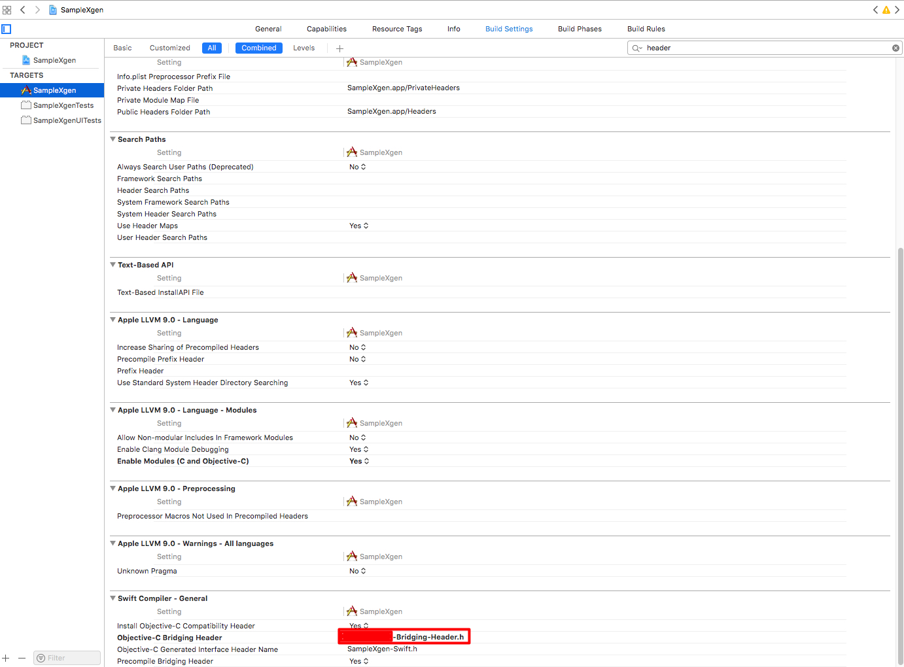

Trabalhei em um projeto que tinha que ser feita a integração entre uma lib C que escrevemos e o IOs e Android. 
Gostei muito de como o swift lida com a Integração de código C/C++. 

### Configurando a Header Bridging

Essa header é que irá fazer a exposição das funções e objetos(não tentei com Objetos C++ ainda) para o swift.
Para configurar a header primeiro crie uma nova header em `File -> New File` (&#8984;N), adicione essa header
como Brindging na configuração do seu projeto indo em `Build Settings -> Swift Compiler - General -> Objective C Briding Header`
, como demonstrado na figura abaixo.

Use essa header para exportar tudo que for necessário para o swift.

Pronto, agora é só usar direto no seu arquivo `.swift` , não precisa de mais nada.

> NOTA: Para a função aparecer no autocomplete do xcode é necessário compilar o projeto primeiro.
