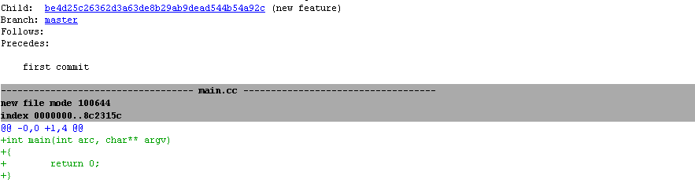
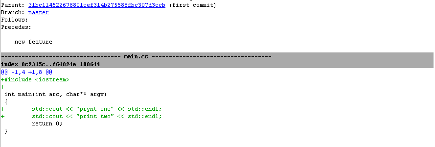
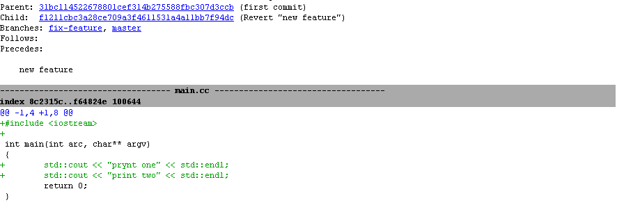
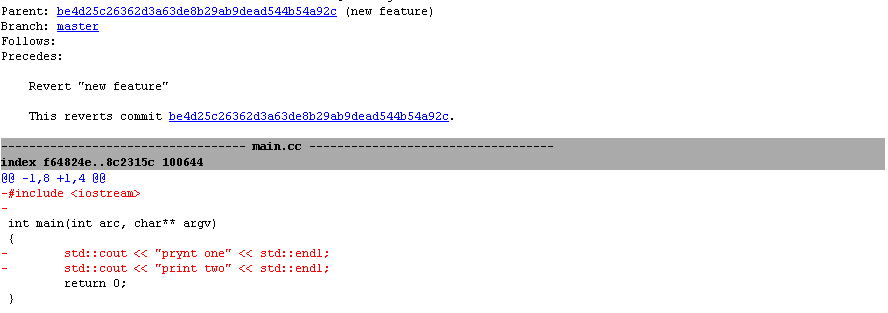
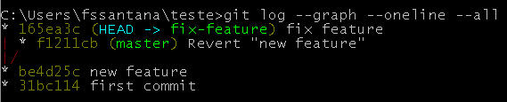
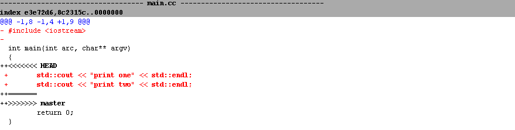
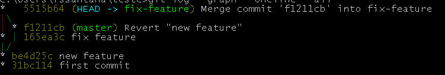
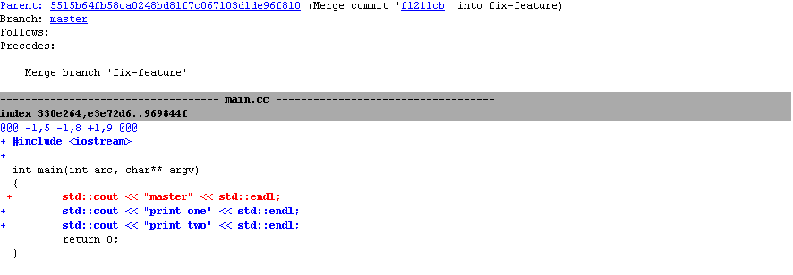

## O caso.

Possa ser que em algum momento você tenha feito um commit/merge cedo de mais, seja por falta de teste ou esqueceu de implementar algo, não importa. Vamos supor que esse commit/merge não será descartado 100%, talvez sejá necessário só fazer alguns ajustes, mas ele não pode ficar no branch principal até que a manutenção seja feita, como proceder?

Usando como o exemplo o código abaixo, o primeiro ```std::cout``` está com o texto errado, somente o segundo está correto, mas os dois foram feitos no mesmo commit.

~~~c++
#include <iostream>

int main(int argc, char **argv)
{
    std::cout << "prynt one" << std::endl;
    std::cout << "print two" << std::endl;
    return 0;
}
~~~






## Uma possível Solução

Primeiro passo aqui é fazer um novo branch ```git checkout -b fix-feature``` por exemplo e usar ```git reverse HEAD``` no master para reverter o último commit. Assim temos o seguinte histórico de commits:





Nesse momento, se você fizer as alterações no novo branch e fazer o merge vai ocorrer um problema, o código do commit ```new feature``` será perdido. O motivo é que o commit ```revert new feature``` irá entrar no merge e na resolução de conflitos ele irá apagar as alterações do ```new feature```:





No conflito do merge da figura acima é possível notar que: O include que não foi alterado será deletado e os foram precisa de resolução manual. Para evitar a perda, antes de fazer um merge com a ```HEAD master```, devemos fazer um merge com o commit ```revert new feature``` usando ```git merge <commit sha> -s ours```, a opção ```-s ours``` resolve os conflitos a favor do branch atual. 



Agora é possível trabalhar em ambos os branches sem o medo de perder código.



## Conclusão

O recurso revert do git é ótimo para desfazer as coisas, mas tem que ficar esperto que o commit de reversão fica no log e pode gerar dor de cabeça.

## Referências

[git merge](https://git-scm.com/docs/git-merge){:target="_blank"}

[git revert](https://git-scm.com/docs/git-revert){:target="_blank"}


