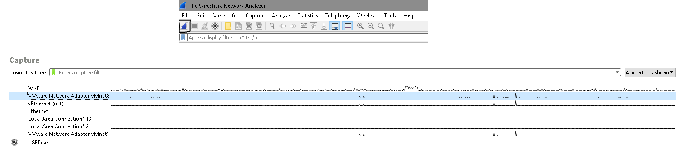
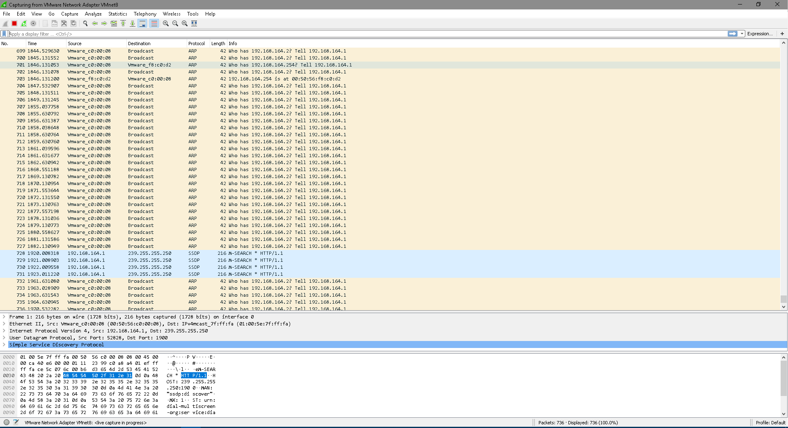
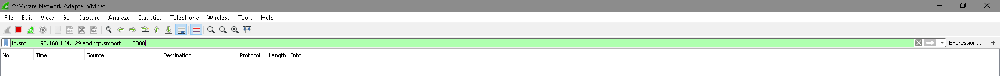
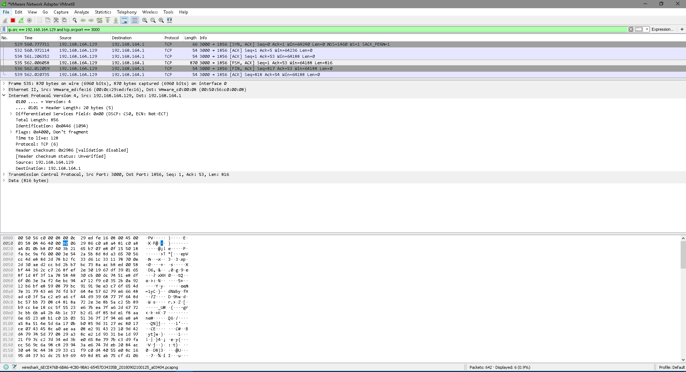

Essa semana me deparei com um bug um pouco chato de resolver. Os dados saem aparente saem do
 servido, mas não chegam no cliente. O debug no código do servidor e cliente estava tudo 
 "Ok". Para ter mais detalhes do problema, precisava saber se os dados estavam mesmo sendo
  transferidos para o cliente. Lembrei do [Wireshark](https://www.wireshark.org/){:target="_blank"} que usava 
  no estágio, ela serve para monitorar transmissão de dados em vários tipos de interface. 
  Esse tutorial usa uma VM por esse motivo 
  [Loopback](https://wiki.wireshark.org/CaptureSetup/Loopback){:target="_blank"} .

Na página inicial do Wireshark 2.6.3 é apresentada várias interfaces,
 imagem 1. No caso do tutorial será selecionada à interface da 
 [VMWare](https://www.vmware.com/){:target="_blank"}. Inicie a caputra dos pactes clicando 
 na barbatana azul, e a caputa de pacotes irá começar, imagem 2.

 

 

## Filtrando as informações

Se olharmos a imagem 2 tem muita informação que não é interressante para nós no momento.
 Podemos reduzir a quantidade de informações 
 usando {:target="_blank"} 
 e ele será baseado no servidor como source. 
 Como estamos trabalhando com TCP/IP, vamos precisar do: ip da maquina e a porta que o server
  está usando.

 

Na imagem acima fizemos um filtro baseado no ip e tcp port do source (Quem envia os dados),
 isso siginifca que o wireshark só irá mostrar as informações quando o servido enviar algo.

> Observação: Filtros é um assunto bem extenso, para mais informações de como criar veja   
 {:target="_blank"}.

## Entendendo em tela

Após fazer o filtro e alguns requests, nossa tela será populada com informações divididas em 3 espaços que são: 

- Package List com o histórico de envios e recebimentos dos pacotes;

- Package Details com informações detalhadas de algum pacote selecionado no package list;

- Package Data que mostra os bytes que foram enviados com o pacote;

 

## Conclusão

Wireshark é uma ferramenta ótima para observar a transferência de dados, podendo usar ela como uma ferramenta complementar de debug.

